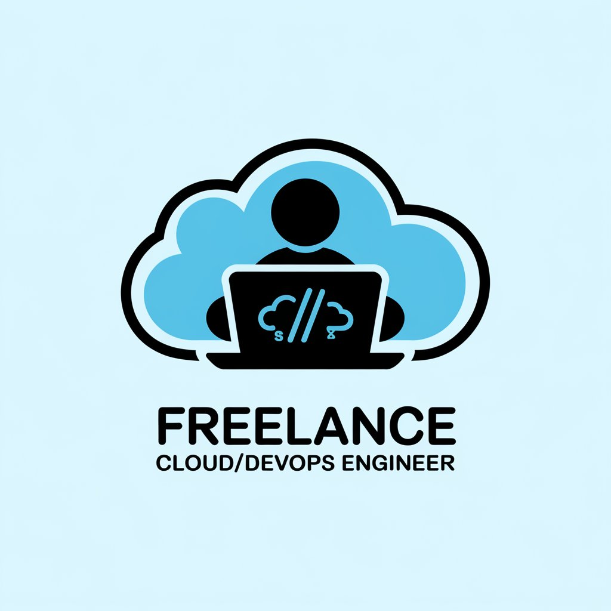

<h2>Hi 👋, I'm Wael</h2>
<h3>A seasoned DevOps Engineer who loves robust, resilient systems designed for scalability and reliability.</h3>

- 🔭 I'm currently working as a **freelance DevOps Engineer**

- 🌱 I'm currently learning **Next.js**

- 👨‍💻 All of my work experiences and projects are available at [https://waelgabsi.com/projects](https://waelgabsi.com/projects)

- 📝 I regularly write articles on [https://waelgabsi.com/blog](https://waelgabsi.com/blog)

- 💬 Ask me about **AWS, Terraform, Kubernetes, CI/CD**

- 📫 How to reach me **contact@waelgabsi.com**

<h3>Languages and Tools:</h3>

